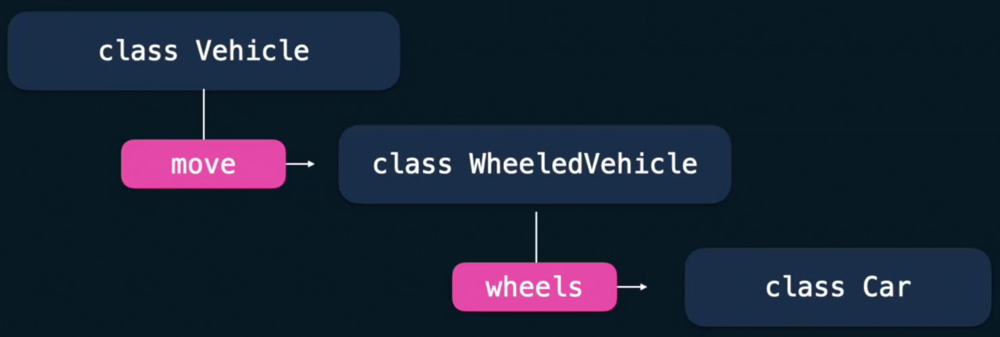

- [Object Oriented Programming](#object-oriented-programming)
	- [Class;](#class)
	- [Constructor Function](#constructor-function)
	- [OOP Methods](#oop-methods)
	- [Inheritance](#inheritance)
	- [Polymorphism](#polymorphism)

# Object Oriented Programming

Procedural

- Distinguishes data(variables) and code (modules and functions)
- The program is divided into data types and functions
- Functions can use data but data cannot use functions
- Data can use methods

Object Oriented

- Data and code are enclosed together in classes
- The program is divided into objects, which include data and methods
- Objects exchange data and activate their methods

## Class;

Object:
An object's properties can be added or removed at any time

Instances of the same Class can have different properties because some properties are added with class methods if those are invoked

One of the default attributes of a class, which comes along whenever we create a class, is the **dict**.
we can call it from the object:
`my_obj.__dict__`
but we can also call it from the class:
`MyClass.__dict__`

Another way besides **dict** to check if an object or a class has a specific attribute is:the built-in function 'hasattr()'

## Constructor Function

- special function called to create an object each time the class is invoked
- name of the constructor function is always `__init__` and needs atleast one parameter usually named `self`
- when a class component starts with two underscores it becomes private. The property can in that case only be accessed from within the class. This is called encapsulation

superclass

- an abstract class from which other more specific objects can derive

hasattr

- specifies whether an instance contain a certain attribute

instance variable

- a variable that is created and added to the object on initialization

**Class Variables**

Contrary to instance variables, class variables are stored outside any object, thus:

- they aren't shown in an object's `__dict__`
- they always return the same value in all class instances (objects), except if they are altered inside the class method. In the latter case, any new object that invokes that method, alters the class variable's value
- they can still be accessed with the `hasattr()` function and with `object.<variable>` notation
- they can be private like any other properties and accessed with `'_ClassName__PrivatePropertyName'` notation

## OOP Methods

- Method is a function embedded in a class
- It requires to take atleast one parameter `self`
- if a class has constructor, this method is automatically invoked when the object of the class is onstantiated
- the constructor method cannot return a value
- its sole purpose is to return a newly created object with posible parameters that we pass to it.
- you cannot invoke it frmo the object itself or from inside the class.
- methods are functions created inside a class
- methods always take the parameter 'self' when is defined
- methods are invoked from objects, functions are stand-alone

- `self` allows an object instance to access all its class properties and methods
- We don't need to add `self` when we invoke the method, only on its class definition

a class has some built-in attributes:
dict, module, bases (a tple containing direct superclass of a class)

Introspection: the ability of a program to examine the type and properties of an object at runtime.

Reflection: the ability of a program to manipulate the values, properties and methods of an object at runtime.

the constructor method of the class if it exists is always invoked when we create an object?

```python
class Bean:
    def __init__(self, color)
        self.color = color

greenbean = Bean("green")

greenbean = Bean(color="green")


class One:
    count = 1
    def __init__(self):
        self.first = True
    def add(self, num):
        self.count += num

one = One()

One.__bases__
type(one).__name__


class Dog:
    def __init__(self, name, breed):
        self.name = name
        self.breed = breed

pet1 = Dog("Max", "Lab")
print(pet1)

# Output
<__main__.Dog object at 0x10bcb4ad0> # Address at which the object is stored in memory.
									 # looks for str method to use the string.

```

`__str__` gives unique identity to a method

## Inheritance

- Passing attributes and methods from a superclass to a newly created subclass
- Subclasses are simply a more specialized version of a class
- We can build upon other classes for refined properties
- `issubclass()` is used to find if a class is a asubclass



How does the subclass inherit the constructor from the superclass `var` being a class parameter.

- By calling `super.__init__(var)`
- By calling the `superclass.__init__(self, var)`
- By adding the superclass name within parenthesis on its declaration

## Polymorphism

The ability to change superclass behaviour
helps keep code clean and consistent

Another way to construct adaptabel classes is composition technique

Inheritance extends a class's capabilities by adding new components and modifying existing ones
Composition can use other objects (derived from other classes or not) and implement the desired parts of the other objects' properties


MRO (Method Resolution Order): the way a pragrammning language scans through upper part of a classe's hierarchy to find the method(entity) it currently needs


Which of the following code options return True if the following code snippet is executed?


Python  throws AttributeError when it cannot find a property in an object or in a class

In single inheritance we can opt not to include the parent's constructor while in multiple it is required

the subclass override the superclass methods By defining a method with the same name as in the superclass


- In multiple inheritance, Python scans from left to right.
- In multiple inheritance, if one of the superclasses is also a subclass, python also looks from bottom to top
